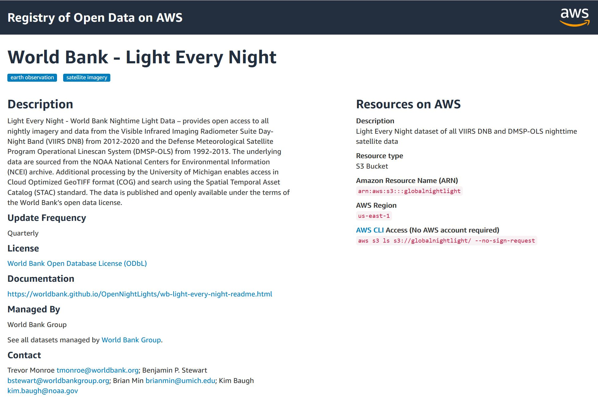
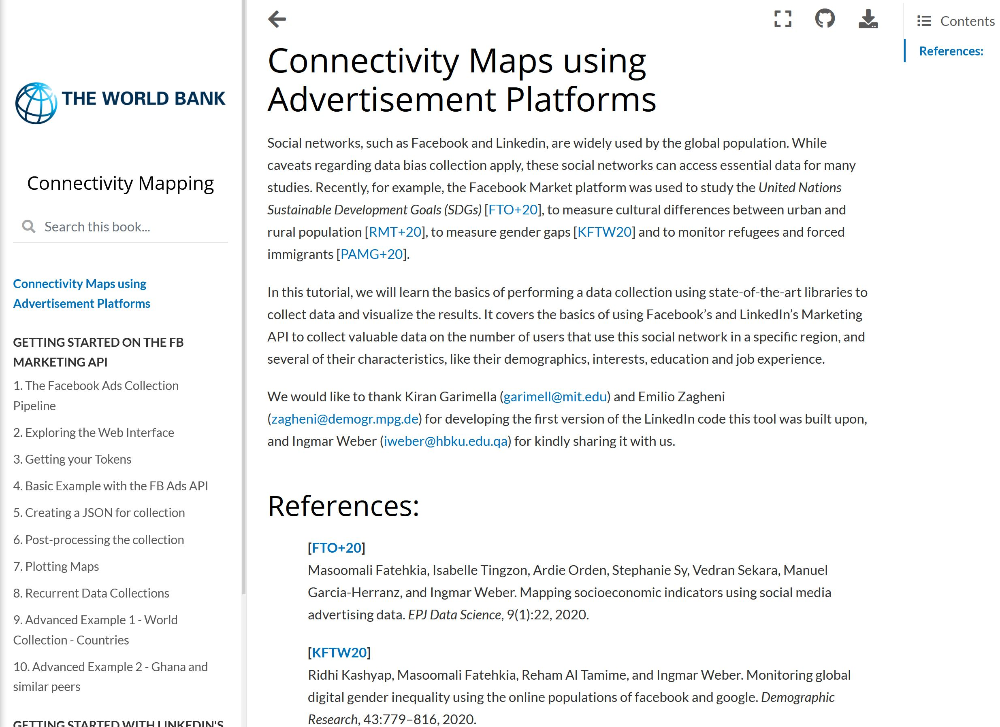
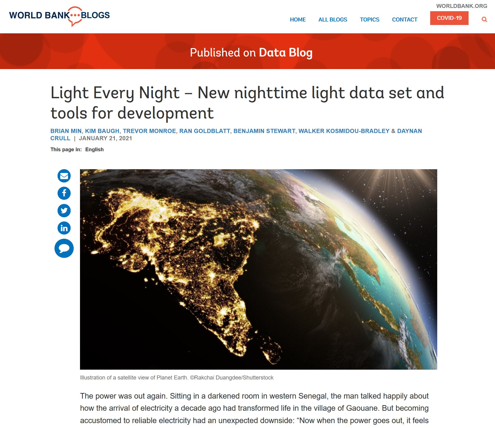
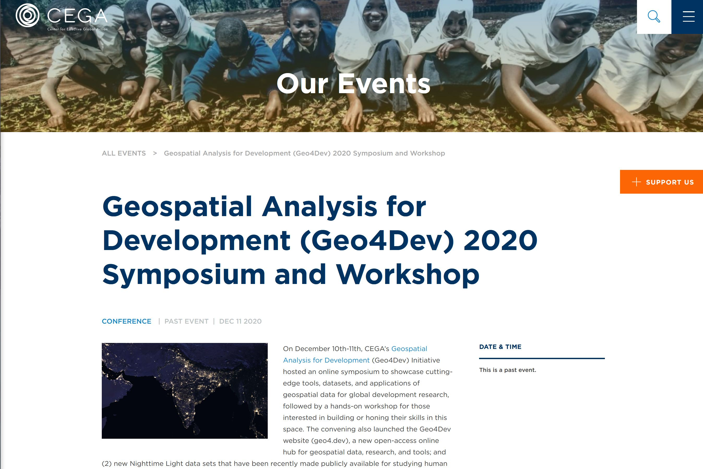
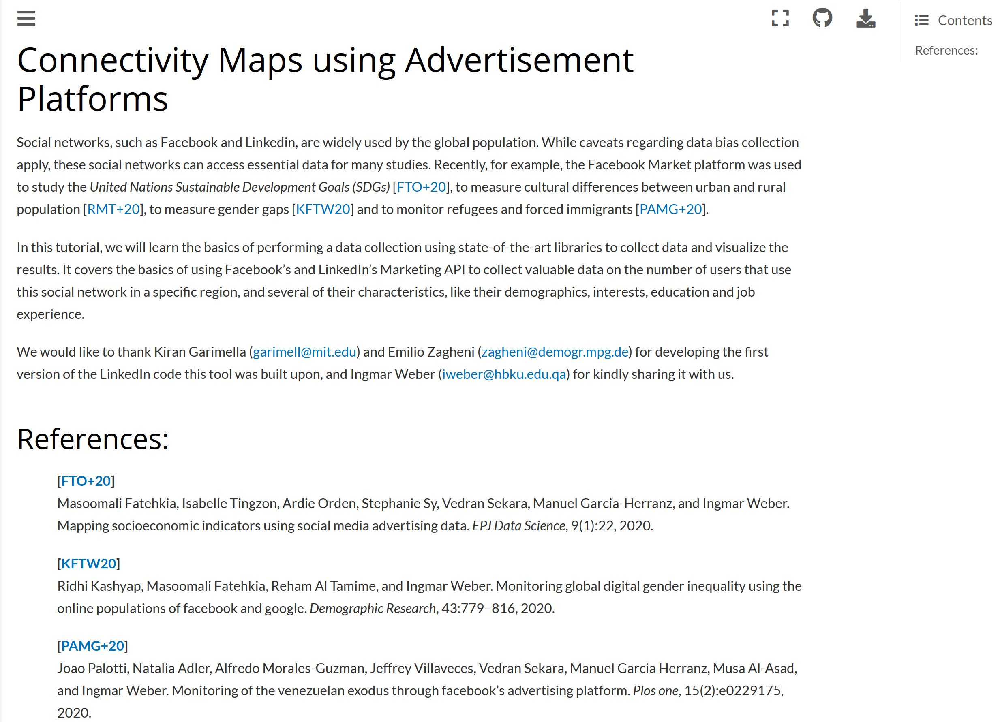
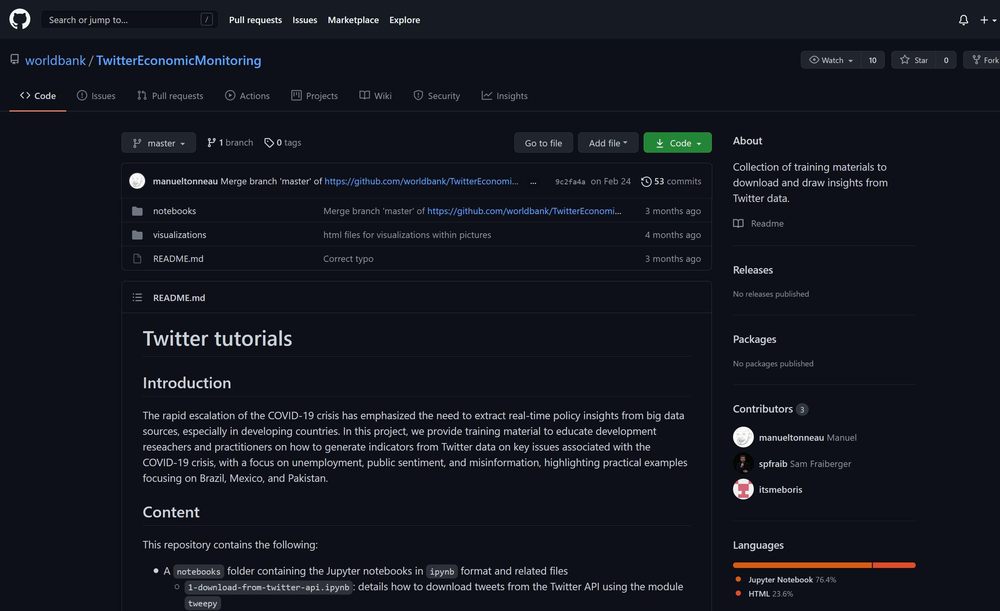
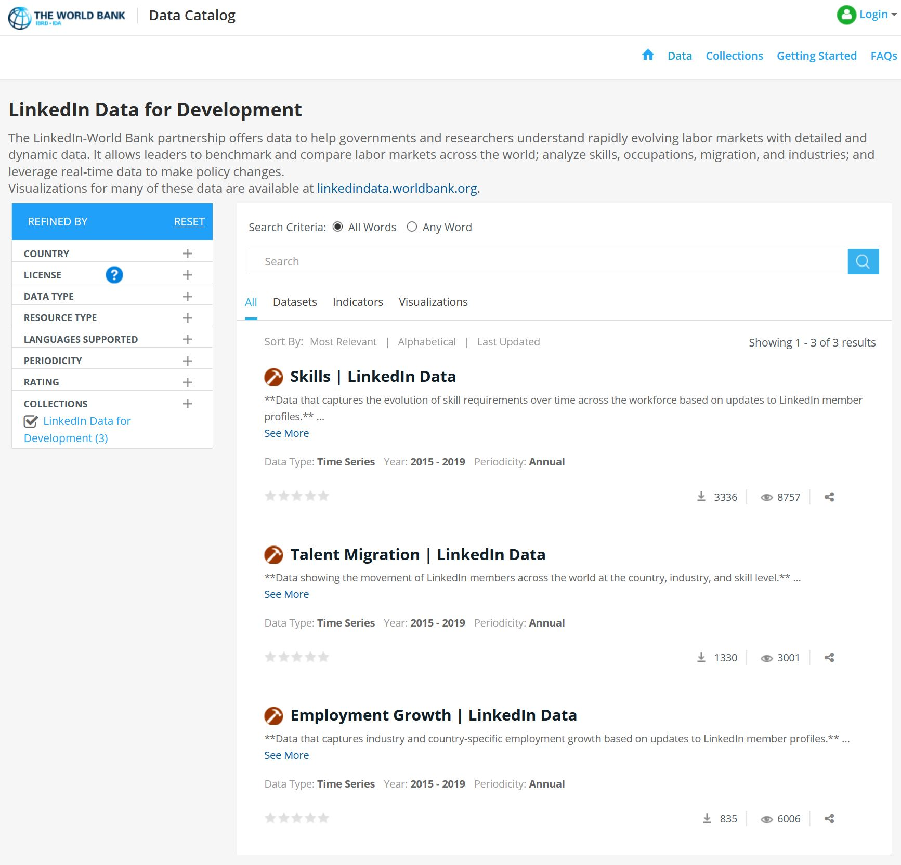
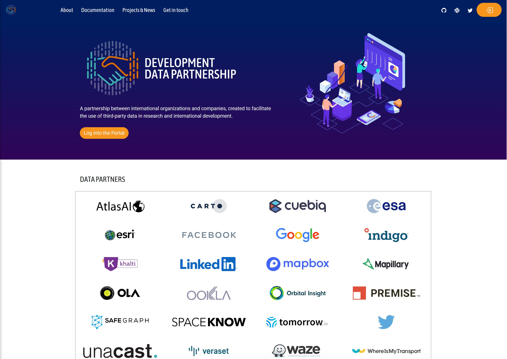
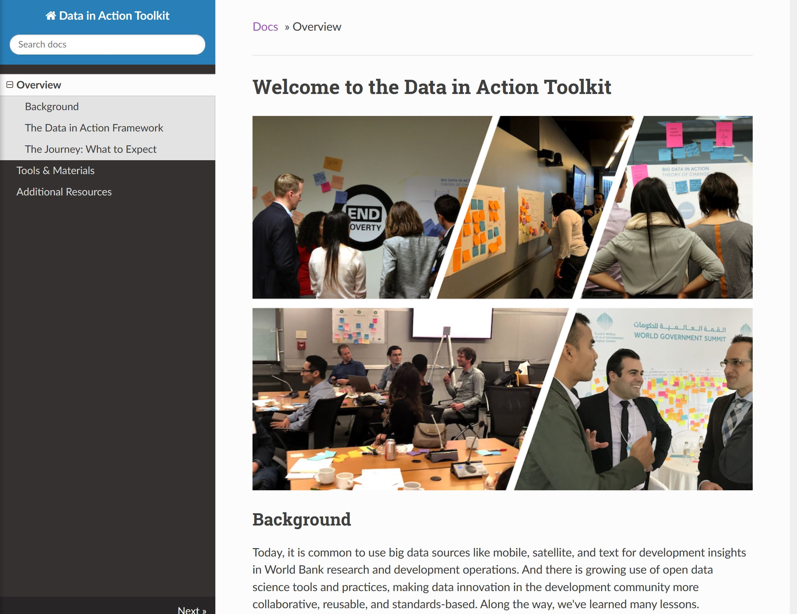

<html>

<head>
    
</head>

<body>
    

        <h1>Nighttime Light Data and Tutorials</h1>
        <h4>Utilize the World Bank's latest resources related to aquiring, analyzing, and implimenting open-access
            nighttime lights data.</h4>
    

    

        

            
            
1. World Bank Nighttime Light data on AWS open Data
            

        

        

            
            
2. Open Nighttime Light Tutorials

        

        

            
            
3. Blog post describing nighttime light data in action

        

        

            
            
4. World Bank and CEGA Geo4Dev symposium on nighttime light in development

        

    

    

        <h1>Social Data Collection Tools</h1>
        <h4>Harness massive social data collection tools related data from Facebook, Linkedin, and Twitter.</h4>
    

    

        

            
            
1. Connectivity Maps using Facebook and Linkedin

        

        

            
            
2. Twitter Economic Monitoring

        

    

    

        <h1>Linkedin Data for Development</h1>
        <h4>Understand rapidly evolving labor markets with detailed and dynamic data Linkedin Data tools and tutorials.
        </h4>
    

    

        

            
            
1. Public Linkedin Development Data Catalog 

        

        

            
            
2. Development Data Partnership, facilitating 3rd party data for research and development
            

        

        

            
            
3. Skills Benchmarking Tutorial

        

    

    

        <h1>Data Products Toolkit</h1>
        <h4>Make informed decisions about your data needs and insight implementation, using the World Bank's
            comprehensive Data in
            Action Toolkit.
        </h4>
    

    

        

            
            
1. Data in Action Toolkit, for an organized approach to open data science tools and
                practices

        

    

    

        <h1>Acknowledgements</h1>
    

    

        <h4>Many of the resources published in this repository benefited from generous support from the Trust Fund for
            Statistical Capacity Building III (TFSCB-III), which is funded by the United Kingdom’s Foreign, Commonwealth
            & Development Office, the Department of Foreign Affairs and Trade of Ireland, and the Governments of Canada
            and Korea; as well as support from the Research Support Budget in the Development Economics Vice-Presidency.
        </h4>
    

</body>

</html>
